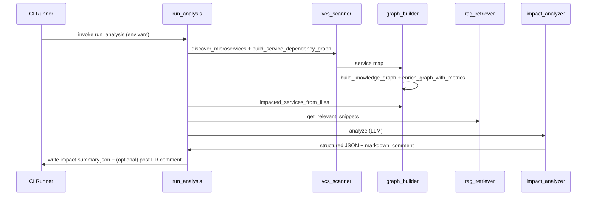

<!-- filepath: c:\data\maincode\impact-ai-engine-optimized-main\README.md -->
# 🚀 AI Optimized Impact Analyzer Engine - Impact Delphyne

🎯 Stop the Fire Drill: Precise Impact Analysis for Services, APIs & Infrastructure

🌟 Project Overview

The AI Optimized Impact Analyzer Engine is a specialized, reproducible analysis tool designed to **eliminate guesswork** in complex service and infrastructure environments. **When a developer submits a code change, this engine executes in CI to build a dynamic knowledge graph of the entire landscape (microservices, API gateways, client SDKs, Nginx/Apigee configs, CRUD services, and databases), accurately tracing the downstream ripple effect of the change**.

Our core innovation lies in the seamless integration of **knowledge graph pathfinding (NetworkX) with Retrieval-Augmented Generation (RAG)**. This fusion allows us to not only identify which components are affected but also provide an LLM-driven explanation, risk score, and recommended mitigation actions—all packaged into a concise, ready-to-post Pull Request comment.

The result is instant, high-confidence feedback, transforming code review from a manual, error-prone process into an automated, data-driven security and stability check.

---

## Key Features

- 🌐 **Repository & Artifact Discovery** — Intelligently scans repositories to discover services, APIs, gateways, configuration and contract artifacts.
  - What this means: locates folders, code, OpenAPI/proto contracts and infra configs (Nginx/Apigee) across any repo.
- 🧠 **Knowledge Graph Mapping** — Builds an enriched, directed NetworkX graph, calculating metrics like PageRank and Centrality to prioritize critical components.
  - What this means: models components as graph nodes and communications as edges so pathfinding and centrality reveal high-impact areas.
- 🔎 **Change-to-Impact Pathing** — Maps specific changed files to starting nodes and computes the full downstream impact path across the graph.
  - What this means: determines which services, APIs or infra pieces downstream may be affected by a change.
- 📚 **Contextual Retrieval (RAG)** — Chunks and embeds relevant code snippets, using nearest-neighbor search (FAISS/NumPy) to retrieve highly specific context for LLM analysis.
  - What this means: supplies evidence (code hunks/config lines) to the LLM so findings are explainable and auditable.
- 🤖 **LLM-Driven Risk Analysis** — Orchestrates the language model (OpenAI/Gemini) to produce a structured `impact-summary.json` artifact and a rich HTML/Markdown PR comment.
  - What this means: generates both machine-readable data for automation and reviewer-friendly markdown for PRs.
- 📈 **Risk Quantification** — Generates a normalized risk estimate (0-100) based on path complexity, component centrality, and content analysis.
  - What this means: summarizes severity using graph metrics and contextual heuristics to help reviewers prioritize.

---

## Overview & Core responsibilities

This repository implements an engine that estimates the runtime impact of code changes across a microservice landscape and produces a concise PR comment (HTML + Markdown) and a JSON artifact summarizing affected services and risk. It is designed as a best-effort, reproducible analyzer to be executed in CI or locally.

**Core responsibilities**:
- Discover service folders and code artifacts
- Infer service-to-service dependencies
- Build an enriched knowledge graph (NetworkX)
- Map changed files to starting nodes and compute downstream impact
- Retrieve code snippets using RAG (optional embeddings + FAISS)
- Orchestrate LLM analysis to produce a structured JSON and a markdown PR comment
- Produce an on-disk artifact: `impact-summary.json`

---

## System Architecture (brief)

The analyzer follows a robust, four-stage pipeline designed for execution speed and reproducibility.

**Data Flow and Stages**:

1. Discovery & Scanning: Identifies services and parses artifacts (code, OpenAPI, Proto) to extract communication patterns.
2. Graph Construction: Builds a directed NetworkX graph, enriching nodes and edges with metrics (PageRank, centrality).
3. Retrieval: Extracts and scores relevant code snippets for changed files using RAG for contextual depth.
4. Analysis & Formatting: Calls the LLM with context, generating a structured JSON artifact and a human-readable PR summary.

---

## Quick summary of important files

- `run_analysis.py` — main entrypoint (`run_analysis.run_analysis`) and helpers
- `analyzer/vcs_scanner.py` — repo scanning, import/url extraction, contract discovery, mapping files -> services
- `analyzer/graph_builder.py` — build, enrich (metrics), and serialize the knowledge graph
- `analyzer/rag_retriever.py` — chunking and embedding helper for RAG retrieval
- `analyzer/impact_analyzer.py` — LLM orchestration (structured JSON + markdown output)
- `tests/` — pytest test-suite
- `.github/workflows/impact-analysis.yml` — example CI integration
- `impact-summary.json` — sample output artifact

---

## Architecture

At a high level the analyzer is composed of four stages:

1. Discovery & scanning — find services and parse their artifacts (code, openapi, proto)
2. Graph construction — build a directed NetworkX graph and attach metrics
3. Retrieval — extract/score relevant snippets for changed files (RAG)
4. Analysis & formatting — call LLM to produce JSON + markdown summary

Mermaid sequence (rendered by GitHub if available):



---

## Execution (detailed)

Prerequisites
- Python 3.10+ (project CI uses 3.12 but the code is compatible with 3.10+)
- Install deps: `pip install -r requirements.txt`

### Environment variables

| Variable | Description | Default | Required |
|---|---|---:|:---:|
| REPOS_BASE_DIR | Root path containing all microservice folders. | `.` | Yes |
| CHANGED_FILES | Newline-separated paths of changed files (relative to REPOS_BASE_DIR). | N/A | Yes |
| OPENAI_API_KEY | API key for LLM calls and RAG embeddings. | N/A | No |
| PR_TITLE | Title of the Pull Request for inclusion in output. | N/A | No |

**Local run example (POSIX)**:

```sh
export REPOS_BASE_DIR=/path/to/repo
export CHANGED_FILES="svc-a/app.py"
export PR_TITLE="Fix auth bug"
python run_analysis.py
```

What run_analysis produces
- `impact-summary.json` — structured artifact containing generated_at, pr_title, changed_files, impacted services list and a numeric risk estimate
- `markdown_comment` (returned by LLM) — ready-to-post HTML+Markdown summary (not automatically posted by this repo)

Interpretation of outputs
- `impacted` — list of service objects (name, severity, explanation, recommended actions)
- `risk_estimate` — integer summary score normalized by heuristics in the code (0-100)

---
### Tech & Concepts matrix

| Category | Technologies Used | Concept/Library Focus |
|---|---|---|
| Graph & Analysis | Python, NetworkX, NumPy | Directed graphs, Pagerank, Betweenness Centrality, Vector operations. |
| Language Models | OpenAI/Gemini API | Embeddings for RAG, Structured JSON response generation, Fallback clients. |
| Code Parsing | Python AST, Regex, esprima | Robust, language-agnostic import/contract extraction and URL detection. |
| Vector Search | FAISS (Optional) | High-performance vector index for nearest neighbor search in RAG. |
| Contracts & Tools | OpenAPI/Proto Parsers, pytest, GitHub Actions | Best-effort contract discovery, Unit testing, CI/CD integration. |

---

## Technology concepts and libraries used

- Python — orchestration language and tests
- NetworkX — directed knowledge graph, metrics (pagerank, centrality, betweenness, SCC)
- AST parsing (Python) and optional `esprima` for JS/TS — robust import extraction
- Regex heuristics — URL detection and fallback parsing
- OpenAPI (YAML/JSON) & Proto parsing — contract discovery (best-effort)
- Retrieval-Augmented Generation (RAG) — chunking + embeddings + nearest neighbor retrieval
- OpenAI Embeddings & Chat API — snippet scoring and LLM-based analysis (fallback to legacy client supported)
- FAISS (optional) — vector index for fast nearest neighbor search
- NumPy — vector operations during embedding handling
- pytest — unit tests and CI validation
- GitHub Actions — sample workflow to run analyzer in PRs

---

## Tests & CI

Run unit tests locally:

```sh
pytest -q
```

Key tests to inspect:
- `tests/test_contract_diff.py` — contract discovery and parsing
- `tests/test_graph_metrics.py` — knowledge graph creation & metrics
- `tests/test_llm_mock.py` — LLM orchestration and fallback behavior
- `tests/test_run_analysis.py` — end-to-end run using env variables

CI sample job
- `.github/workflows/impact-analysis.yml` demonstrates using the repository in a PR environment: it sets env vars, runs `run_analysis.py`, and records `impact-summary.json`.

---

## Design notes and limitations

- Best-effort & non-fatal: failures in embeddings or LLM calls fall back to simpler outputs.
- Contract parsing is conservative — complex/invalid OpenAPI or proto files may be partially parsed.
- JS/TS parsing uses `esprima` if available; regex fallback is less accurate.
- Mapping changed files -> services is heuristic-driven (path matching, token identifiers, content inspection).
- RAG improves LLM context but requires `OPENAI_API_KEY` and optionally FAISS; otherwise raw snippets are used.

Security & privacy
- LLM calls (OpenAI) send code and snippets to external APIs; sanitize secrets and do not expose PII.

---

## Workflow

| Step | File / Concept |
|---|---|
| Entry Point | `run_analysis.py` (`run_analysis.run_analysis`) 
| Discovery | `analyzer/vcs_scanner.py` (contract parsing) 
| Graphing | `analyzer/graph_builder.py` (NetworkX & Metrics) 
| RAG/Embeddings | `analyzer/rag_retriever.py` (FAISS, NumPy, OpenAI Embeddings) 
| LLM Output | `analyzer/impact_analyzer.py` (Structured JSON & Markdown) 
| Testing | `tests/` (Unit tests via `pytest -q`)
| CI Example | `.github/workflows/impact-analysis.yml` 

---

## Recommendations for demonstration

- Run end-to-end with a small example repo that contains 2–3 services and a single changed file.
- Show `impact-summary.json` and the LLM-produced `markdown_comment`.
- Highlight how pagerank/centrality affect severity prioritization in prompts.

---

## Contact & next steps

For further improvements consider:
- Add a small sample repository under `examples/` demonstrating common contract patterns
- Add a simple PR poster script that uses GitHub token to post the `markdown_comment`
- Provide optional local FAISS index building for faster retrieval during demo runs

---


**_Last updated: 2025-11-21_**


